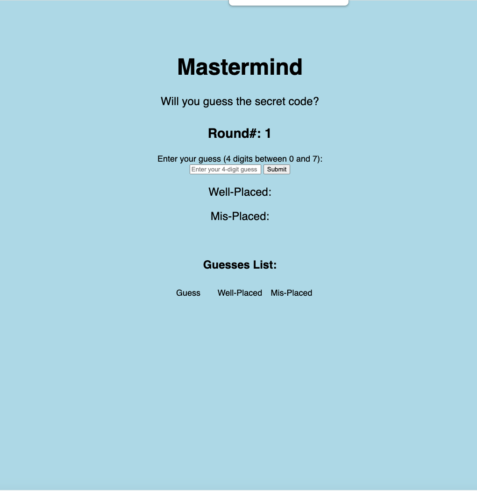

Welcome to My Mastermind

Team: Anthea Ip
Problem: Create an application to showcase HTML and CSS. I created this Mastermind app in Javascript, and added a front end with HTML and CSS. 

There is one player against the program. I considered how a user might play the game; they would want to be able to:

View the round number
Enter their guess
View the Well-Placed and Mis-Placed pieces
View the history of their guesses and outcomes
View whether they won, or exceeded their number of tries.

The secret is composed of 4 unique numbers out of 8 total (0 -7).

The player has by default 10 tries to guess the secret. After each guess, the program will indicate the number of correctly placed pieces (Well-Placed) and incorrectly placed pieces (Mis-Placed). 

Example: 
Secret: "0123"
Guess: "3021"
Well-Placed: 1 (2 is in the correct place)
Mis-Placed: 3 (0, 1, and 3 are in the secret, but in the wrong place)

Implementation
This program will randomly generate the 4-unique digit secret. It will check if the input is valid (4 numbers), and will give an error if not. The previous guesses and results will be displayed in a table to the right. There will be a message if the player guesses the secret, as well as if the player exceeds the number of tries.

The secret is set at 4 digits for simplicity. The maximum tries typically defaults to 10, but for ease-of-testing and demonstration, I've set it to 5.

The JS code contains functions:
Play game
    Make secret
    Make secret counts
    Play round
        Submit guess
            Validate guess
            Make guess counts
            Get well-placed number
                Display player won
            Get mis-placed number
        

I added an event listener to either start the game (if the round number is 1), or play a round. I used DOM elements to grab the input guess from the HTML, then display the Round, Well-Placed and Mis-Placed numbers, and the guess history. When the secret is guessed, the grid-container with the updated values sets to 'none' so it's no longer visible, and a new div with the winning message is created and appended into the HTML.

HTML:
I created a grid layout. All the elements are in one grid-container. The fields that update based on the input guess (Round, Input Form, Well-Placed and Mis-Placed pieces) are in a grid-container that displayes to 'none' when the game is won or tries exceeded. The guess history list is in a separate div.

 alt="Opening Page" title="Opening Page">

Future Features
Add color coding to the history of guesses indicating which pieces are Well-Placed vs. Mis-Placed.
Add "