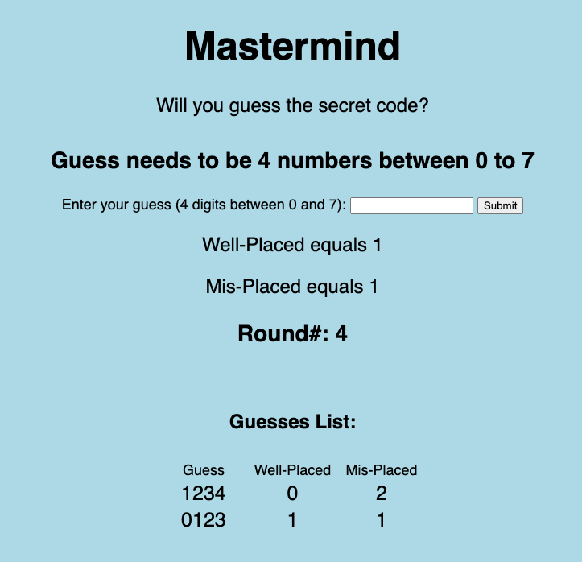
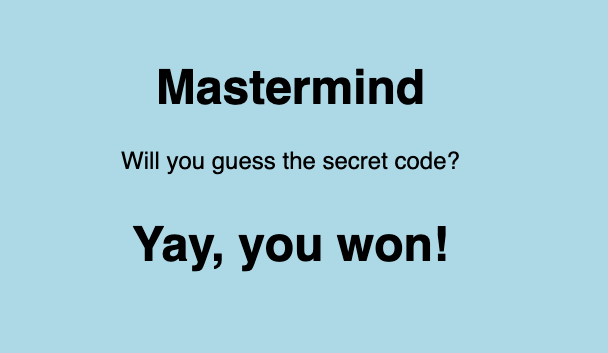
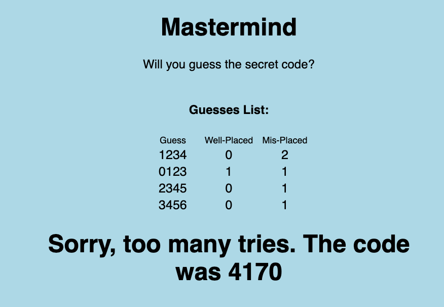

# Welcome to My Mastermind

## About Me
I'm an aspiring software engineer. I started my career as a semiconductor engineer where I worked on a team and with our customers to release our technology. I then got a life-changing opportunity to be a recruiter. In my recruiting role, I got a great opportunity to be part of a team to rebuild our recruiting process. I got to do more brainstorming, troubleshooting, and work with our engineers and engineering leadership more. Then it struck me . . . I really missed being part of a team that builds a product. Which brought me to coding. 

I self-learned a little, then completed General Assembly's Software Engineering Program. I felt like I just grazed the surface on learning to code, so I enrolled in software engineering school Qwasar to continue to build my skills. I love it so much that I became a teaching assistant to help my classmates grow their skills.
     

## Game Background
The secret is composed of 4 unique numbers out of 8 total (0 -7).

The player has by default 10 tries to guess the secret. After each guess, the program will indicate the results (number of correctly placed pieces, Well-Placed, and incorrectly placed pieces, Mis-Placed). 

- Example: 
    - Secret: "0123"
    - Guess: "3021"
    - Well-Placed: 1 (2 is in the correct place)
    - Mis-Placed: 3 (0, 1, and 3 are in the secret, but in the wrong place)
     
    
## Who Worked on the Project?
This is mostly a sole project. However, I did seek advice from a former classmate on event listeners, DOM variables and manipulation, and usability. (He's passionate about creating games.) I also got advice and feedback from a startup frontend engineer.
     
## Problem I'm Solving
I needed to create an application to showcase HTML and CSS. I had previously created a C-language Mastermind project. I felt the game's player interaction would be a great project to add a frontend. I created this Mastermind app in Javascript, and added a frontend with HTML and CSS. 
     
## User I'm Trying to Solve Problems for
The user is the game player, and there is one player against the program. I considered how a user might play the game; they would want to be able to:
1. View the round number
2. Enter their guess
3. View the results (Well-Placed and Mis-Placed pieces)
4. View any input errors
5. View the history of their guesses and outcomes
6. View whether they won, or exceeded their number of tries.
     

## Design Process / Requirements
1. Create the JS file
2. Create the HTML frontend
3. Create the CSS styling

Javascript Requirements:
- Create a secret
- Input a guess
- Check validity of guess
- Output round number, well-placed, mis-placed pieces
- Indicate if user wins
- Indicate if user does not win

Frontend Requirements:
- Overall structure. I needed to be able to explain my project and weigh simplicity vs. capability. This project seemed relatively simple (in terms of considering a framework).

- Input fields and output.
   
    - Start the game: In node, the user types 'node mmind.js' in the terminal. I needed my HTML to be able to start the game.
        - Ideally, I thought it would be simpler for the user to add their guess and this would start the game instead of a separate start and submit buttons.
    
    - The user would need to input their guess, and then need to be able to see the results (round number, well-placed, and mis-placed numbers). 
        - Guess input and results output: My html would need to access the user's guess, and then access the JS variables and display them as the results

    - The user would need to see an error if their guess was not valid (4 digits), and still be able to access the guess form

    - The user would need to see if they won (and ideally not be able to enter another guess)

    - The user would need to see if they exhausted all of their tries (game end)

    - I thought it would be useful to see the history of guesses, but did not implement this initially. 

- Styling requirements
    - I wanted the text to be centered, but not take the full view width  

    - The "Mastermind" and "Will you guess the secret code?" lines are static over the course of the game, while the results fields will be dynamic. 

    - While the win message displays, the input/results and guess history fields hide

    - While the lose message displayes, the input/results fields hide

    - The guess history should be separate from the input and results field (not the main focus)

     

## Creating the Frontend / Implementation
 Javascript Implementation:
 I first created the javascript logic and ran in node to confirm the output, errors, messages.
 - This program will randomly generate the 4-unique digit secret. It will check if the input is valid (4 numbers), and will give an error if not. The previous guesses and results will be displayed in a table. There will be a message if the player guesses the secret, as well as if the player exceeds the number of tries.

- The secret is set at 4 digits for simplicity. 
- The maximum tries typically defaults to 10, but for ease-of-testing and demonstration, I've set it to 5.
- Functions in JS:
    - Play game
        - Make secret
        - Make secret counts
        - Play round
            - Submit guess
                - Validate guess
                - Make guess counts
                - Get well-placed number
                    - Display player won
                - Get mis-placed number
            - Too many guesses message

HTML Implementation:
- I wanted to be able to keep the implementation simple and explain my work, so I decided to use plain JS rather than a framework.
- Start the game: I added an event listener to, based on the round number, either start the game or play a round. This simplifies the layout (no need for separate start and submit buttons).

- Guess input / See results: I added DOM element variables in my JS that would either grab input or inject the values into the HTML and therefore be viewable. For example,
    - const guessInput = document.getElementById("guess");  
     
- As I was trying to implement the event listener and DOM manipulation was not proceeding as I had hoped. I contacted my former classmate who loves to make games, to get insight and unstick. We also brainstormed on the usability (guess history), and player "hints" (future feature to color-code the results).

- Invalid Guess: If a user inputs a guess of incorrect length or characters, they should see an error, but still be able to input an alternative guess. I simply have a DOM element for an error that is empty when guess is valid, and contains an error message if the guess is not valid.

- You Won: If the user wins, they should see a large "You Won!" type of message. The input form and results are no longer relevant, so I create a div in the JS when the user guesses the secret, and switch the input and results field view off (display: "none")

- Too Many Tries: If the user exhausts their tries, they should see a large message. The input form is no longer relevant, but they might want to compare their guesses to the secret. I created a div in the JS that displays the message and secret, and switch the input and results fields view off (display: "none")

- Guess History: I initially created an array and pushed new guesses into the guess history array. But then I thought it would be useful to have the results in addition to the guesses. I achieved this by creating a table template in the HTML, and appending a new row with guess, well-placed, and mis-placed results for each guess.

Styling Implementation:
- In my manager interview, we discussed flex-boxes and grid layout. This inspired me to try a grid layout.
    - See grid wireframe below

- Grid container consumes the view height and width. 
    - It's split into three columns, with the middle column being twice as wide as the ends (1fr 2fr 1fr).

- The static lines in the main grid-container
    - The results into a nested container whose display switches to "none" when the user wins or exceeds the tries. 
    - The guess history is also in a nested container within the main one.
- I spaced the lines by editing grid-row-start

Screen Captures:

- Opening page:

     
- With Guesses:

     
- Invalid Guess:

     
- You Won:

     
- Exceeded Tries:

 
 

- Grid Wireframe

 
 

## Future Features
This was a fun project! I'd love to build on it and add more features:
- Add color coding to the history of guesses indicating which pieces are Well-Placed vs. Mis-Placed.
- Add remaining number of rounds
- Add a tutorial / guided walk-through
